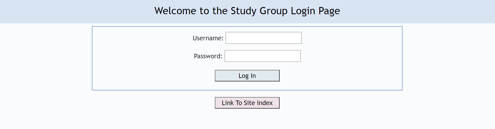

# Study Chat Room

# Deployed Study Link
Link: https://arcane-scrubland-50171.herokuapp.com/

# Technologies Used:
MVC Model Setup. Node JS. Javascript. Sequelize. Express. Express-Handlebars Templates. Socket io.

## Description:

The study group page is about studying your favorite topic with others. The application features a login page where the user is asked to enter a username and password. At the study group selection page, the user has the choice of rooms they want to enter. Javascript, Python, or HTML. Go into the javascript room, enter your name and email, and a list of users joining the room are displayed. To the chat on the right is a socket.io studying conversation where all the studying details and questions are being asked by the users.

Photo Details:

User Login Page

Study Group Selection Page

User Login Page

